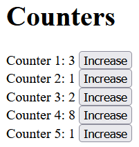

Simple study project: "distributed counting". 



## Technologies used

- `Kotlin`
- `Spring WebFlux`
- `Redis`

Different instances of backend periodically fetch counters from Redis and 
send new values through WebSocket to clients (frontend).

## How to run

```shell
  docker compose up
```

```shell
  gradlew bootRun
```